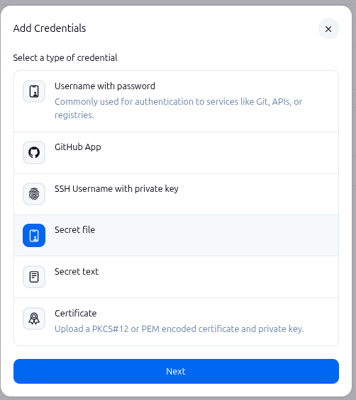
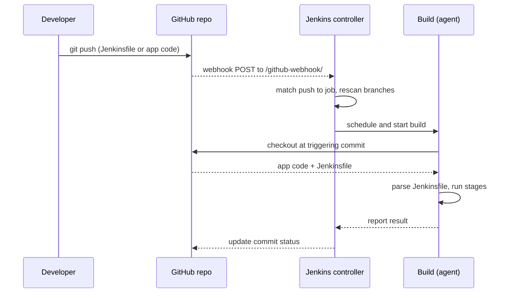
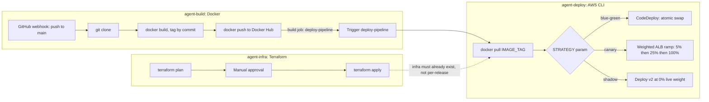

# Jenkins: Security, Hardening & Production Patterns

Everything past a single working pipeline: locking down credentials and
the controller itself, backing up `JENKINS_HOME`, writing pipelines as a
real checked-in `Jenkinsfile`, letting Jenkins react to pushes automatically
via multibranch pipelines and webhooks, an alternate registry-push
deployment shape, and splitting one big pipeline into several
purpose-scoped ones. Builds directly on the real pipeline in
[Jenkins: Production Deployment Pipelines](jenkins-production-deployment-pipelines.md).

## Plugin Hygiene, the Credentials Store & Folder-Level Security

Three separate concerns that all show up under "Manage Jenkins," easy to
conflate.

### Plugin hygiene

- Every installed plugin is both an attack surface and a maintenance
  burden — each one can introduce its own vulnerabilities, and each one
  needs updating independently.
- Install only what a pipeline actually needs, keep an inventory of what's
  installed and why, and pin versions rather than auto-updating blindly —
  the same reasoning as pinning Terraform provider versions, applied to
  Jenkins' own plugin ecosystem.

### The credentials store

Jenkins has a built-in, encrypted credential store (*Manage Jenkins →
Credentials*) — AWS keys, SSH keys, tokens are added there once and
referenced by ID from a `Jenkinsfile`, never hardcoded into pipeline code:

``` groovy
withCredentials([usernamePassword(credentialsId: 'ecr-creds', usernameVariable: 'USER', passwordVariable: 'PASS')]) {
  sh 'docker login -u $USER -p $PASS ...'
}
```

!!! danger "A credential ID in a Jenkinsfile is not the credential"

    `credentialsId: 'ecr-creds'` is just a lookup key — the actual secret value never appears in the pipeline source, never gets committed to the repo, and Jenkins actively masks it out of build console logs. Anyone who can edit the Jenkinsfile can use the credential, but they can't read its value from the code itself.

### Choosing a credential type

**Manage Jenkins → Credentials → (a store) → Add Credentials** offers six
shapes, not just one generic "secret" — picking the one that actually
matches what's being stored, instead of defaulting to whichever type was
used last, is what makes the credential usable the way a step actually
expects it.

[](../images/credential-types.png){ target="_blank" rel="noopener" }

*The credential-type picker — six distinct shapes, each exposed
differently to a pipeline step.*

| Credential type | Use it for | Real-world tradeoff |
|---|---|---|
| Username with password | Any username+token/password pair — git over HTTPS (`github-pat`), Docker Hub (`dockerhub-creds`), most registries and REST APIs | The most universally supported type and the simplest to set up; a genuinely long-lived static secret unless the "password" field actually holds a scoped, revocable token rather than a real account password |
| GitHub App | GitHub access shared across many jobs or an entire org, rather than one person's token | Jenkins holds an App ID and a private key, then mints a short-lived, auto-rotating installation token per use — nothing long-lived sits in the credential store at all, and access doesn't vanish when whoever registered it leaves. Costs more to set up once (registering the App, installing it, generating a key) than a PAT generated in a minute |
| SSH Username with private key | Git over SSH, scoped to exactly one repo via a GitHub deploy key | No password ever transmitted, and a deploy key can be read-only and repo-scoped; doesn't work on a network that blocks outbound SSH (port 22), and rotation/revocation is manual unless something else automates it |
| Secret file | A secret that's naturally a whole file, not a string — a `kubeconfig`, a cloud service-account JSON key, a license file, a `.pem` | Matches the actual shape of the secret instead of awkwardly pasting file contents into a text field; a consuming step has to read it via a temp file path (`withCredentials([file(...)])`), one more layer of indirection than a plain env var |
| Secret text | A single opaque value with no username — an API key, a webhook token, a Slack token | The simplest possible shape for a one-value secret; forces anything that actually needs more than one field (a username *and* a token) into a single string, which then has to be parsed back apart manually |
| Certificate | Mutual TLS or code-signing — a service that requires a client certificate rather than a bearer token or password | The correct fit exactly when a target genuinely requires certificate-based auth; unnecessary complexity as a stand-in for any of the simpler types above |

!!! danger "The credential type doesn't enforce what actually goes in the 'password' field"

    - "Username with password" works equally well whether the password field holds a real account password or a narrowly-scoped, individually-revocable token — Jenkins has no way to tell the difference, and both look identical once masked in a console log.
    - `github-pat` and `dockerhub-creds` (below) are both this type, and both are deliberately fine-grained tokens (a repo-scoped GitHub PAT, a Docker Hub access token), not either account's actual login password.
    - Precisely so that leaking or rotating one doesn't mean rotating the account's real password, and so the blast radius of a compromised Jenkins credential store is one repo or one registry, not a whole account.

### Credential providers: the store isn't always Jenkins' own

Every credential covered so far (`github-pat`, `dockerhub-creds`) lives in
Jenkins' own built-in encrypted store — but that store is just the
*default* **credential provider**, not the only one.

- Jenkins exposes credential lookup as a pluggable extension point, so a
  plugin can make Jenkins fetch a credential from an external system
  instead, on demand, at build time — HashiCorp Vault, AWS Secrets
  Manager, Azure Key Vault, CyberArk Conjur, Google Secret Manager, and
  Kubernetes Secrets all have a credentials-provider plugin.
- A `credentialsId:` in a Jenkinsfile looks identical either way — the
  pipeline code doesn't change, only where Jenkins actually resolves that
  ID from does.

| Reason to use an external provider instead | Why it matters in a real organization |
|---|---|
| Single source of truth | Most orgs already keep secrets in a company-wide vault used by many systems, not just Jenkins. An external provider means Jenkins reads the same secret everyone else does, instead of a second copy pasted into Jenkins that can quietly drift out of sync. |
| Centralized rotation | Rotate the secret once in Vault/Secrets Manager and every consumer, Jenkins included, picks it up automatically. With Jenkins' own store, someone has to remember to log in and update it by hand every time. |
| Dynamic, short-lived secrets | Vault in particular can issue a database credential valid for just a few minutes, auto-expiring on its own. Jenkins' own store holds a static value indefinitely until someone manually changes it — a leaked value there stays valid until then. |
| Audit trail and access policy | Enterprise secret managers log every read — who, what, when — and enforce fine-grained access policies. Jenkins' own store doesn't give that level of visibility. |
| Compliance | Some frameworks require secrets to live only in one approved, audited vault, not "encrypted at rest inside a CI tool" — however good that encryption actually is. |

!!! danger "Reduced blast radius is the big one, given the backup story below"

    `JENKINS_HOME` (see the backup section below) is exactly where Jenkins' own credential store persists every secret, encrypted, on disk. Anyone who obtains `JENKINS_HOME` plus its master key can decrypt every credential ever added, all at once — the backup itself becomes something that needs the same protection as the secrets it contains. With an external provider, Jenkins only ever holds a short-lived read credential (a Vault token, an IAM role), fetches the real secret at request time, and never writes it to disk at all — compromising the controller, or leaking a `JENKINS_HOME` backup, no longer hands over every secret it's ever used.

!!! success "The right call for a small learning setup is still Jenkins' own store"

    A single-person learning setup has no external vault to stand up or maintain, and no second system already depending on the same secrets — Jenkins' built-in store (`github-pat`, `dockerhub-creds`) is the simpler, correct choice here. The tradeoffs above become the deciding factor at real organizational scale — many teams, many services sharing secrets, and a compliance requirement or an incident response plan that actually depends on centralized rotation and audit — not because the built-in store is broken for a project this size.

### Folder-level security

- Folders aren't just organization — they're a permission and
  credential-scoping boundary.
- A credential added inside a folder is only visible to jobs inside that
  same folder, and role-based/matrix security can grant a team full
  control over their own folder's jobs without touching anyone else's.
- This is what makes multi-team Jenkins viable on one shared controller
  instead of needing a separate instance per team.

## Backing Up JENKINS_HOME

`JENKINS_HOME` holds everything: every job's configuration, full build
history, encrypted credentials, and every installed plugin's binary.
Losing it is losing the entire Jenkins instance's identity, not just the
compute it happened to run on.

|  | EBS snapshot | ThinBackup (plugin) |
|---|---|---|
| What it captures | The entire volume, byte for byte | Job configs, build records, and credentials specifically — Jenkins-aware |
| Restore unit | The whole volume, as one point in time | Selectable — restore just job configs without touching build history, or vice versa |
| Where it lives | Infra-level (the same EBS-volume mechanism as any other point-in-time recovery, e.g. RDS backups) | Jenkins-level, scheduled from inside the Jenkins UI itself |

!!! danger "An untested backup is a hope, not a backup"

    The same principle from every other backup strategy applies here without modification: a snapshot that's never been restored is unverified. Actually restoring a `JENKINS_HOME` snapshot onto a fresh controller at least once, before it's needed for real, is what turns "we take backups" into "we know recovery actually works."

## The Declarative Jenkinsfile

A `Jenkinsfile` is Jenkins' equivalent of a Terraform config — a checked-in
file describing a pipeline as code, instead of clicking through the UI to
define a job.

``` groovy
pipeline {
  agent { label 'linux' }

  parameters {
    choice(name: 'ENVIRONMENT', choices: ['dev', 'stg'], description: 'Target environment')
  }

  environment {
    AWS_REGION = 'ap-south-1'
  }

  stages {
    stage('Test') {
      steps { sh 'npm test' }
    }
    stage('Deploy') {
      when { branch 'main' }
      steps { sh "./deploy.sh ${params.ENVIRONMENT}" }
    }
  }

  post {
    failure { echo 'Notify the team -- build failed' }
    always  { cleanWs() }
  }
}
```

`agent`
:   Where this pipeline runs — a label, a specific Docker image, or `none` if each stage declares its own.

`parameters`
:   Build-time user input — a dropdown, a string field, a checkbox — collected before the pipeline starts, referenced as `params.NAME`.

`environment`
:   Environment variables available to every step in the pipeline (or scoped to just one `stage` if declared inside it instead).

`when`
:   Guards a `stage` — here, the `Deploy` stage only actually runs on the `main` branch, though it's still evaluated (and skipped) on every other branch's run.

`post`
:   Runs after the pipeline finishes, regardless of outcome — `always`, `success`, `failure`, and others let cleanup or notification logic depend on how the run ended, the closest Jenkins equivalent to a `try`/`finally`.

## Multibranch Pipelines, Webhooks & Shared Libraries

Three pieces that turn "one Jenkinsfile" into "a real CI setup serving a
whole repository."

### From `git push` to a running pipeline, step by step

The answer to "how does Jenkins get the updated pipeline without someone
copy-pasting it in": it doesn't get synced at all. Jenkins re-fetches the
`Jenkinsfile` from git fresh, on every single run.

1. **A developer edits the `Jenkinsfile`** (or any application code) and pushes to a branch on GitHub — the same as any other commit, no separate "deploy the pipeline" step.
2. **GitHub's webhook fires immediately** — configured once, under the repo's *Settings → Webhooks*, pointing at `https://<jenkins-url>/github-webhook/` (this is exactly what the setup wizard's URL-configuration step matters for later). GitHub POSTs a payload describing the push the moment it happens.
3. **Jenkins' GitHub plugin receives that payload** and matches it against every job listening for it — "GitHub hook trigger for GITScm polling" (checked in a job's own config), or a Multibranch Pipeline's repository scan, below.
4. **A Multibranch Pipeline re-scans the repository** at this point too — if the push was to a brand-new branch with its own `Jenkinsfile`, this is where a dedicated job for that branch gets created; if a branch was deleted, its job gets torn down.
5. **Jenkins schedules and starts a build** for the affected branch's job.
6. **The build's first action is checking out the repository again** — at exactly the commit that triggered it, via the SCM configuration behind "Pipeline script from SCM," or an explicit `checkout scm` step. This pulls back *both* the application code and the just-pushed `Jenkinsfile` — nothing about the pipeline definition carried over from the previous run.
7. **Jenkins parses that freshly-checked-out `Jenkinsfile`** and compiles it into a running pipeline. This is the exact moment any change to the pipeline logic itself takes effect — the file Jenkins just read off disk is the one from the commit pushed seconds earlier, never a stale copy sitting in Jenkins' own configuration.
8. **The pipeline's `stages` run** against that same checkout — Build, Test, Deploy, whatever the Jenkinsfile declares — followed by its `post {}` block.
9. **Jenkins reports the result back to GitHub** (a green check or red X against the commit/PR, when the plugin's configured for it), and the Multibranch Pipeline's own UI reflects the new build under that branch.



!!! success "Why this eliminates the copy-paste entirely"

    Nothing in this flow stores the Jenkinsfile's *contents* anywhere in Jenkins' own configuration — step 6 fetches it fresh from git on every run. A push to `main` doesn't need a manual second step to "update Jenkins with the new pipeline"; the checkout in step 6 already *is* that update. This is the same reason "Pipeline script" (typed directly into the job, see [Setup & Pipeline Configuration](jenkins-setup-and-pipeline-configuration.md)) is the wrong choice: it's the one path in Jenkins that *doesn't* re-fetch anything, so it's the one place a stale, manually-pasted copy can actually happen.

### Multibranch pipeline

Instead of one job per branch created by hand, a multibranch pipeline job
scans a repository and automatically creates (and destroys) a pipeline run
per branch and per pull request — each one running the *same*
`Jenkinsfile`, checked into that specific branch, so a feature branch can
even modify its own pipeline before merging.

### Webhooks

Without a webhook, Jenkins has to poll the repository on a timer to notice
new commits — slow, and wasteful when nothing's changed. A webhook has
GitHub/GitLab push an event to Jenkins the moment a commit or PR happens,
triggering the build immediately instead of waiting for the next poll.

### Shared libraries

A shared library is a separate git repository of reusable Groovy pipeline
code (conventionally under `vars/` and `src/`), loaded into any Jenkinsfile
that needs it:

``` groovy
@Library('platform-shared-lib') _

pipeline {
  agent { label 'linux' }
  stages {
    stage('Deploy') {
      steps { deployToEcs(service: 'order-service', environment: 'dev') }
    }
  }
}
```

!!! success "The same reasoning as a Terraform module"

    `deployToEcs(...)` above is a function defined once in the shared library and called from every pipeline that needs to deploy to ECS — the exact same motivation as extracting a reusable Terraform module: once the same handful of steps shows up in a third Jenkinsfile, that's the signal to stop copy-pasting Groovy and put it in one place every pipeline calls instead.

## Certified Jenkins Engineer (CJE)

CloudBees' [Certified Jenkins Engineer (CJE)](https://university.cloudbees.com/certification-guide-and-information)
exam, last updated September 2023, is the external validation for Jenkins
specifically. Worth knowing before searching further: CloudBees retired a
similarly-named *CCJE* (Certified CloudBees Jenkins Engineer) credential
back in 2022 — CJE, without the extra "C," is the one still active.

|  |  |
|---|---|
| Format | 60 multiple-choice questions, 90 minutes |
| Passing score | 66% |
| Prerequisites | None formally, though CloudBees recommends real hands-on Jenkins experience first |
| Tests against | Open-source Jenkins core (not CloudBees CI/Operations Center specifically) |

### The four exam domains

1. **Jenkins Fundamentals** — core CI/CD concepts, jobs and builds, source code management integration, plugins, security (authentication/authorization), the REST API
2. **Jenkins Administration** — installation, distributed builds, controller/agent configuration, credentials, artifact and fingerprint management, notifications
3. **Pipeline (Build Technologies)** — declarative pipeline syntax, stages and steps, multibranch pipelines, shared libraries, promotion strategies, upstream/downstream triggering
4. **Freestyle (Build Technologies)** — the older, UI-configured job type predating Pipeline-as-code — still a real exam section even though this material skips straight to declarative pipelines

!!! danger "Public breakdowns of the exact weighting disagree"

    Unlike some other certification programs with a single official, current objectives page, CloudBees doesn't publish one canonical up-to-date percentage breakdown — third-party prep sites list different weightings and even different section names for the same four domains. Treat the domain list above as directionally reliable, but verify specifics against CloudBees' own current study guide before relying on any one source's exact percentages.

!!! success "Where the material above already lands"

    Controller/agent architecture, installation itself, connecting a distributed agent (almost word for word "distributed builds, controller/agent configuration" in the Administration domain), job types and Pipeline job configuration, source code management integration and credentials (named explicitly in the Fundamentals domain), real-world pipeline/deployment troubleshooting (not a named exam topic, but exactly the kind of "why did the green build not actually work" judgment the Pipeline domain expects), a complete real deployment pipeline end to end (the shape of pipeline the Pipeline domain's "build technologies" objective actually expects), plugin/credential/folder security, the declarative Jenkinsfile, and multibranch/shared libraries all map directly onto the Administration and Pipeline domains — the two domains carrying the most exam weight in every breakdown found. Freestyle jobs get only a brief mention above but no deep-dive — worth a dedicated look before sitting this exam, since it's still a full CJE section.

## A Different Shape: Push to Docker Hub Instead of Building Where You Deploy

The real pipeline walkthrough builds the Docker image and immediately runs
it, in place, on the same agent that just cloned the code — the image
never leaves that one machine. A second, genuinely different pipeline
(`jenkins/pipeline/docker-image-push-pipeline.gvy`) builds the image once
and pushes it to Docker Hub instead, so *any* machine with Docker and a
pull credential can run the exact same, already-tested image — not a
machine that also needs git access, GitHub credentials, and the project's
own build toolchain.

### The pipeline

``` groovy
pipeline{
    agent {label 'agent-one'}
    stages{
        stage("Code"){
            steps{
                git credentialsId: 'github-pat', url: 'https://github.com/Fahad-Md-Kamal/investor-pro.git', branch:"main"
                sh "mv .env.example .env"
            }
        }
        stage("Build"){
            when {
                anyOf {
                    changeset "Dockerfile"
                    changeset "src/**"
                    changeset "pyproject.toml"
                    changeset "uv.lock"
                }
            }
            steps{
                sh "docker build -t investor-pro:${env.BUILD_NUMBER} ."
            }
        }
        stage("Push to Dockerhub"){
            when {
                anyOf {
                    changeset "Dockerfile"
                    changeset "src/**"
                    changeset "pyproject.toml"
                    changeset "uv.lock"
                }
            }
            steps{
                withCredentials([usernamePassword(credentialsId: 'dockerhub-creds', usernameVariable: 'DOCKER_USER', passwordVariable: 'DOCKER_PASS')]) {
                    sh 'echo $DOCKER_PASS | docker login -u $DOCKER_USER --password-stdin'
                    sh "docker tag investor-pro:${env.BUILD_NUMBER} fahadmdkamal801/investor-pro:${env.BUILD_NUMBER}"
                    sh "docker push fahadmdkamal801/investor-pro:${env.BUILD_NUMBER}"
                }
            }
        }
        stage("Deploy"){
            steps{
                sh "make start"
            }
        }
    }
}
```

Setup-Data and Ingest All Data (see
[Production Deployment Pipelines](jenkins-production-deployment-pipelines.md))
carry over unchanged after this — the registry push only changes how the
image *gets to* the Deploy stage, not what happens once the app is
running.

| Stage | What's different from the plain pipeline | Why |
|---|---|---|
| Build | Tags with only `${env.BUILD_NUMBER}` — no floating `:latest`. | `:latest` matters for a local `docker run`/`docker compose` picking the most recent build off the same machine; once an image is pushed under an explicit tag, nothing downstream needs to guess "latest" locally. |
| Push to Dockerhub | New stage — logs into Docker Hub and pushes the just-built image by name. | This is the actual point of the alternate pipeline: after this stage, the image exists independently of the agent that built it. |
| Deploy | Unchanged — `make start` → `docker compose up -d --build`. | In this project's current form, Deploy still *rebuilds* locally rather than pulling the pushed image — the push exists so the image is *available* to pull elsewhere, not because this particular Deploy stage consumes it yet. A registry-consuming deploy would replace `--build` with a plain `docker compose pull && docker compose up -d`, referencing the pushed tag instead of building from source again. |

!!! note "The registry push doesn't (yet) change what Deploy actually runs"

    Right now Build creates a local image, Push sends a copy to Docker Hub, and Deploy still rebuilds from source rather than pulling what was just pushed — so the pushed image isn't actually consumed by this pipeline yet. That's fine as a first step, but the real payoff of this approach — a separate host, or a separate pipeline, pulling the exact tested artifact instead of rebuilding it — only shows up once something downstream actually runs `docker pull fahadmdkamal801/investor-pro:<tag>` instead of building again.

### The pipeline, step by step

`stage("Code")`
:   Clones the repo with the same scoped `github-pat` credential, checks out `main`, and turns the committed `.env.example` into the real `.env` — identical to the point-to-point deploy's own Code stage.

`stage("Build")`
:   Gated by `when { anyOf { changeset ... } }` (see below) — only runs if the commits this build picked up actually touched `Dockerfile`, `src/**`, `pyproject.toml`, or `uv.lock`. When it does run: `docker build -t investor-pro:${env.BUILD_NUMBER} .` builds the image and tags it with just the Jenkins build number — no `:latest` this time (see the stage-differences table above for why).

`stage("Push to Dockerhub")`
:   Gated by the same `when` condition as Build, so the two stages always agree — Push never runs against an image Build didn't just create. `withCredentials([...])` binds the stored Docker Hub username and password to two masked environment variables, scoped to just this block. Three shell steps run in order inside it: log in (`docker login`, fed the password over stdin so it never shows up in `ps` output or shell history), re-tag the just-built image under the Docker Hub namespace (`fahadmdkamal801/investor-pro:...` — Docker Hub requires the image name prefixed with the account it's being pushed to), then push it.

`stage("Deploy")`
:   `make start` → `docker compose up -d --build`, the same as before — rebuilds and (re)starts the app locally. Doesn't yet consume the image that was just pushed (see the note above).

### Why this is a different shape, not just an extra stage

- The plain pipeline ties build and deploy together: whatever machine has
  the source checked out is also the machine that ends up running the
  container.
- That's simple, but it means every deploy target needs git access,
  GitHub credentials, and the full build toolchain (Docker, Compose,
  Buildx, `make`).
- Pushing to a registry breaks that coupling: build once, on one machine
  that's allowed to see the source, and let every other machine that
  needs to run the app pull an already-built, already-tagged image and
  nothing else.
- It's the same "build once, deploy the identical artifact everywhere"
  principle behind an AMI or an immutable Terraform-provisioned resource —
  a registry just does it for containers instead of instances.

### `withCredentials` here, vs. the `git` step's own `credentialsId`

Both stages authenticate to something, but through two different
mechanisms, worth telling apart on purpose:

| Step | Mechanism | Why |
|---|---|---|
| `git credentialsId: 'github-pat', ...` | Native — the `git` step accepts a `credentialsId` parameter directly, and Jenkins resolves and applies it internally. The token is never exposed as a shell variable. | `git` is a first-class Jenkins step that already knows how to authenticate. |
| `docker login` inside `withCredentials([usernamePassword(...)])` | Generic — `docker login` is a plain shell command, not a Jenkins step, so there's no `credentialsId:` parameter to give it. `withCredentials` binds the stored credential to masked environment variables (`DOCKER_USER`, `DOCKER_PASS`) for just that block, and the `sh` step uses them explicitly. | Only needed when the thing being authenticated is a raw CLI call with no native Jenkins-step integration. |

!!! note "A native alternative exists for Docker specifically"

    The Docker Pipeline plugin provides `docker.withRegistry('https://registry.hub.docker.com', 'dockerhub-creds') { docker.image(...).push() }` — the same "the step handles the credential internally" shape as the `git` step, instead of manually piping a password into `docker login`. Not required — the manual version above works fine — just the same kind of upgrade the `git` step already represents over hand-rolling authentication.

### Avoiding a rebuild-and-push on every run, even with no code changes

Without a guard, Build and Push run unconditionally every single time the
pipeline executes — including a manual re-run where nothing in the repo
actually changed since the last one. That's wasted build time, a new
~1.3GB layer set pushed for no reason, and disk pressure on whichever
agent runs it.

`when { anyOf { changeset ... } }` — the fix actually applied above
:   A `when` block on a stage can gate it on Jenkins' own SCM changelog for that build — the set of files the commits it just picked up actually touched. `changeset` takes one pattern per call, so checking several paths means one `changeset` line per path inside `anyOf { ... }` — `changeset "Dockerfile"`, `changeset "src/**"`, `changeset "pyproject.toml"`, `changeset "uv.lock"`, any one of which being true runs the stage. A run triggered by a docs-only commit matches none of them and skips Build and Push entirely, no extra state needed to track it. A plain re-run with no new commits at all has an empty changelog, so the same condition skips that too. Both stages repeat the identical `when` block on purpose — Push must never run against an image Build didn't just (re)create, and since both conditions are evaluated against the same build's changelog, they always agree.

Comparing the current commit against the last one successfully pushed — a stricter fit, not yet applied
:   `changeset` answers "did anything change since the last build," which isn't quite "since the last *successful push*." Persisting the pushed commit's SHA somewhere durable (a small file outside the workspace, since the workspace itself can be wiped between builds) and comparing it against `env.GIT_COMMIT` at the start of a run also catches the case a previous run's push actually failed — a `changeset`-only check would stay green on the very next run even though nothing had actually reached Docker Hub yet. Worth adding if a failed push in production actually happens; not needed to get the basic "skip when nothing relevant changed" behavior working.

## Locking Down the Controller: the Global Security Page

**Manage Jenkins → Security** (`configureSecurity` in the URL — an older
name, "Configure Global Security," still shows up there and in a lot of
documentation) is the one screen controlling who can reach Jenkins at all,
and what they can do once they're in. Every pipeline, credential, and
agent covered in this material assumes a controller that's actually
locked down — an open one turns every trick above into something an
anonymous visitor could also do.

[](../images/jenkins-Security-management.png){ target="_blank" rel="noopener" }

*The full Security page on a fresh controller — mostly still at
Jenkins' own defaults. Every field below is covered individually
regardless of screen size.*

### Authentication: who can even log in

Security Realm
:   Where Jenkins checks a username/password against. "Jenkins' own user database" stores accounts inside Jenkins itself — fine for a single small team or a learning setup. A real organization more often points this at LDAP, an existing SSO provider (SAML/OIDC via plugin), or GitHub OAuth — one fewer separate password to manage, and accounts disappear from Jenkins automatically the moment someone leaves the identity provider, instead of lingering as a Jenkins-local account nobody remembers to delete.

Allow users to sign up
:   Only relevant with "Jenkins' own user database" — lets anyone who can reach the login page create their own account, unauthenticated. Off by default, and worth leaving off for anything beyond a personal instance: combined with a permissive Authorization setting below, self-registration can mean "anyone on the internet who finds this URL can grant themselves an account."

### Authorization: what a logged-in user can do

Authorization
:   "Logged-in users can do anything" (the default) means exactly what it says — every authenticated account is a full administrator, with no distinction between "runs builds" and "can rewrite security settings, read every credential's metadata, or delete other people's jobs." Fine for one person's own instance; the wrong choice the moment a second person gets an account. "Matrix-based security" or the Role-based Authorization Strategy plugin replace it with per-user or per-role permission grids — the same folder-level scoping covered above, but enforced globally, before folders even come into it.

Allow anonymous read access
:   Lets anyone reach Jenkins' UI and REST API without logging in at all, read-only. Harmless for an internal dashboard nobody minds being visible; a real exposure if the controller is reachable from the public internet — job configuration, build console logs (which can leak environment details even with credential masking), and the list of installed plugins and their versions are all useful reconnaissance for an attacker, handed over with zero authentication.

!!! danger "The real-world failure mode: sign-up plus full-admin-by-default, left on past a demo"

    - "Allow users to sign up" and "Logged-in users can do anything" are both convenient for a five-minute local demo, and both look harmless since they're one click to reverse later.
    - The actual incidents this combination causes in the wild happen when a controller stood up quickly for a demo or a hackathon stays reachable afterward with the defaults untouched: anyone who finds the URL registers their own account and is instantly a full administrator, credentials store included.
    - The fix isn't a special "hardening mode" to remember later — it's simply not leaving demo defaults on a controller anyone outside the original small circle can reach.

### CSRF Protection

Crumb Issuer
:   Jenkins' defense against Cross-Site Request Forgery — a "crumb" (a per-session token) has to be included on every state-changing request, so a malicious page a logged-in user happens to have open elsewhere can't silently trigger a build or change a setting just by getting their browser to send a request. "Default Crumb Issuer" is the safe default; some older third-party tooling recommends disabling this to simplify scripted API calls, which is exactly the tradeoff to avoid — a scripted client can fetch and send a crumb like anything else, and disabling this reopens the exact attack the setting exists to prevent.

### Agents: TCP port for inbound agents

Fixed / Random / Disable
:   Only relevant if any agent connects *inbound* to the controller (the Inbound/JNLP agent type — the fix for an agent behind NAT the controller can't reach outbound). An agent connected via the controller-initiated SSH method needs no open inbound agent port at all — so "Disable" here is correct for that exact setup, and removes one more open port from the controller's attack surface. Switching to an inbound/JNLP agent later would mean coming back to this exact setting first, or the new agent has nothing to connect to.

### Git Hooks

Allow on Controller / Allow on Agents
:   Both off by default. A git hook is a script git's own tooling runs automatically on certain repository events — allowing one to run **on the controller** means arbitrary script execution on the one process that should never run arbitrary code. It's the same principle as "never build directly on the controller," just reachable through a different door than a pipeline step; leaving both unchecked unless a specific, trusted workflow genuinely needs one is the safer default.

### Sandbox Configuration

Force the use of the sandbox globally in the system
:   The per-script "Use Groovy Sandbox" checkbox is checked by default on any one Pipeline job. This setting removes the choice entirely, instance-wide — no job's script can ever run outside the sandbox, regardless of what an individual job's own configuration says. Worth turning on the moment more than one person can author pipeline scripts on the same controller, since it closes off "someone unchecks the sandbox box on their own job" as a way around the restriction.

### The rest of the page, briefly

| Section | What it's for |
|---|---|
| Markup Formatter | Controls how job/build descriptions render — "Plain text" (safe default, escapes HTML) vs. "Safe HTML," which allows a limited, sanitized HTML subset for richer formatting at a small added complexity cost. |
| Git plugin notifyCommit access tokens | Scoped tokens specifically for the Git plugin's `notifyCommit` webhook URL, separate from a full API token — lets a webhook trigger builds without handing out a broader credential. |
| Prism syntax highlighting | Restricts which on-agent directories the source-code-viewer's syntax highlighter is allowed to read from outside a job's own workspace — closes off a path-traversal-style read of arbitrary files on the agent. |
| Hidden security warnings | Lets an administrator dismiss specific known-issue warnings (e.g. about an outdated plugin) after consciously deciding the risk is accepted, rather than a warning banner persisting forever. |
| API Token | Governs *legacy* API tokens specifically — modern Jenkins issues a distinct, individually revocable token per named purpose instead. Both legacy options here are marked "Not recommended" for exactly that reason: one shared token per user is harder to rotate or scope than several purpose-specific ones. |
| Content Security Policy | A browser-enforced header restricting what the Jenkins UI itself is allowed to load or execute — defends against a compromised or malicious plugin's UI content doing something the rest of the page shouldn't allow. Disabled by default because some older plugins' UIs aren't CSP-compatible yet. |
| Git Host Key Verification Configuration | Controls how Jenkins verifies a remote git server's SSH host key before trusting it — "Known hosts file" matches the same `~/.ssh/known_hosts` trust model any manual `ssh`/`git` client uses, rather than blindly accepting whatever key a server presents. |

!!! success "Verifying this page's settings are actually taking effect"

    No separate "test" button exists — the way to confirm Authorization is actually enforced is to log in (or check anonymously, in a private browser window) as a lower-privileged account and confirm the action that should be blocked actually is, the same "don't just trust the config, check the real behavior" principle applied to a deployed application in [Production Deployment Pipelines](jenkins-production-deployment-pipelines.md). A CSRF crumb rejection shows up as a `403` with `No valid crumb was included in the request` in the response body if a scripted client forgets to fetch and send one — a good sign the protection is live, not a bug to work around by disabling it.

## A Multi-Agent, Multi-Pipeline Deployment: Infra, Build, and Deploy as Three Separate Jobs

Every pipeline shown so far runs start to finish on one agent. A real
platform more often splits the work across three genuinely separate
Jenkins *jobs* — each on its own labeled agent, sometimes literally a
different machine — triggered off each other rather than living as stages
in one Jenkinsfile. This is the same "which comes after which" question
covered in [CI/CD & Progressive Delivery](cicd-and-progressive-delivery.md),
but drawn at the level of physical agents and separate credential scopes
instead of just pipeline stages.

### Why three separate jobs on three separate agents, not one

- **Least privilege, taken further than the credential scoping above** — a
  build agent never needs AWS deploy permissions; a deploy agent never
  needs a GitHub push token or Docker Hub push credentials, only pull
  access and whatever AWS role actually performs the deployment. A
  compromised build agent (a malicious dependency executing code during
  `docker build`, say) simply has no path to production at all, because
  it holds no AWS credentials to reach it with.
- **Independent cadence** — infrastructure changes rarely; the app
  deploys on every merge. A dedicated infra job, with its own trigger and
  its own approval gate, doesn't get dragged along on every app-only
  commit — the same "one pipeline or two" tradeoff covered in
  [CI/CD & Progressive Delivery](cicd-and-progressive-delivery.md), one
  level up, as guarded stages in one pipeline rather than fully separate
  jobs.
- **Toolchain isolation** — the build agent needs Docker and Buildx; the
  deploy agent needs the AWS CLI and IAM permissions for
  ECS/CodeDeploy/ELB; the infra agent needs Terraform. None of the three
  needs what the other two have installed, so none of the three's attack
  surface includes tools it never uses.

### The three pipelines

**1. Infra pipeline — `agent-infra`**

```groovy
pipeline {
    agent { label 'agent-infra' }
    stages {
        stage('Terraform') {
            steps {
                sh 'terraform init'
                sh 'terraform plan -out=tfplan'
                input message: 'Apply this plan?'
                sh 'terraform apply -auto-approve tfplan'
            }
        }
    }
}
```

Triggered manually, or by a webhook scoped to `.tf` file changes (the same
`changeset` guard used above) — not by every commit to the application
repo.

**2. Build pipeline — `agent-build`**

```groovy
pipeline {
    agent { label 'agent-build' }
    stages {
        stage('Code') {
            steps { git credentialsId: 'github-pat', url: 'https://github.com/Fahad-Md-Kamal/investor-pro.git', branch: 'main' }
        }
        stage('Build & Push') {
            steps {
                sh "docker build -t fahadmdkamal801/investor-pro:${env.GIT_COMMIT.take(7)} ."
                withCredentials([usernamePassword(credentialsId: 'dockerhub-creds', usernameVariable: 'DOCKER_USER', passwordVariable: 'DOCKER_PASS')]) {
                    sh 'echo $DOCKER_PASS | docker login -u $DOCKER_USER --password-stdin'
                    sh "docker push fahadmdkamal801/investor-pro:${env.GIT_COMMIT.take(7)}"
                }
            }
        }
        stage('Trigger deploy') {
            steps {
                build job: 'deploy-pipeline',
                      parameters: [
                          string(name: 'IMAGE_TAG', value: env.GIT_COMMIT.take(7)),
                          string(name: 'STRATEGY', value: 'canary')
                      ],
                      wait: false
            }
        }
    }
}
```

Triggered by a GitHub webhook on every push to `main`. Its last stage is
the actual handoff to a different machine — `build job:` starts an
entirely separate Jenkins job, on a different agent, and passes it exactly
which image tag to deploy. `wait: false` means this pipeline reports
success the moment it has kicked off the deploy job, rather than sitting
there watching someone else's job run.

**3. Deploy pipeline — `agent-deploy`**

```groovy
pipeline {
    agent { label 'agent-deploy' }
    parameters {
        string(name: 'IMAGE_TAG', defaultValue: '')
        choice(name: 'STRATEGY', choices: ['blue-green', 'canary', 'shadow'])
    }
    stages {
        stage('Pull image') {
            steps { sh "docker pull fahadmdkamal801/investor-pro:${params.IMAGE_TAG}" }
        }
        stage('Blue/green') {
            when { expression { params.STRATEGY == 'blue-green' } }
            steps { echo "Runs the CodeDeploy stage, IMAGE_TAG substituted in" }
        }
        stage('Canary') {
            when { expression { params.STRATEGY == 'canary' } }
            steps { echo "Runs the weighted-ALB ramp loop" }
        }
        stage('Shadow') {
            when { expression { params.STRATEGY == 'shadow' } }
            steps { echo "Deploys v2 behind its own target group at 0% live weight" }
        }
    }
}
```

This pipeline never touches source code or a Dockerfile at all — it only
ever pulls an already-built, already-tagged image and applies whichever
rollout strategy the `STRATEGY` parameter selects, using the exact
mechanics covered in
[CI/CD & Progressive Delivery](cicd-and-progressive-delivery.md)'s
"Blue/green and canary, driven from the pipeline" section.

### Shadow: the one strategy with no ALB-weight equivalent

- Blue/green and canary both work by adjusting how much production
  traffic reaches v2 — a target-group swap or a weight change.
- Shadow is structurally different: v1 keeps serving 100% of real traffic
  and real responses the whole time, while a *copy* of each request is
  additionally sent to v2, whose response gets thrown away.
- Jenkins' role shrinks accordingly here — it deploys v2 behind its own
  target group at zero live weight, exactly like the first step of a
  canary, but the actual request duplication is handled by something
  outside the ALB entirely (a service mesh route, a Lambda, or the
  application layer itself), since a plain ALB has no "send a copy of
  this request elsewhere and discard the response" mode.
- The deploy pipeline's job stops at "v2 is running and reachable" —
  wiring up the mirroring itself is a separate, one-time infrastructure
  task, not something repeated on every deploy.

### Who needs which credential — and, just as importantly, who doesn't

| Agent | Needs | Never needs |
|---|---|---|
| `agent-infra` | AWS credentials scoped to Terraform's own IAM role, access to the Terraform state backend | A GitHub push token, Docker Hub credentials |
| `agent-build` | `github-pat` (clone), `dockerhub-creds` (push) | Any AWS deploy permission at all |
| `agent-deploy` | Docker Hub pull credentials (if the registry is private), AWS credentials scoped to ECS/CodeDeploy/ELB actions | GitHub credentials, Docker Hub push credentials |

### The full picture: three machines, one release



!!! danger "This is also what limits the damage a compromised build agent can do"

    Because `agent-build` holds `github-pat` and `dockerhub-creds` but zero AWS credentials, the worst outcome of it being compromised is a malicious image getting pushed to Docker Hub — it has no way to reach production directly. That malicious image still has to pass through `agent-deploy`'s own rollout strategy — a canary's metrics-comparison gate, or a blue/green deployment's CloudWatch-alarm-triggered rollback — before it could actually harm real traffic. Splitting the agents doesn't just organize the work; it puts a real gate between "an attacker can push an image" and "an attacker's code runs in production."

!!! success "This is what a genuinely complex, real pipeline looks like"

    Not one Jenkinsfile with twenty stages, but several small, single-purpose pipelines, each on a differently-scoped agent, connected by explicit `build job:` triggers instead of implicit sequential stages — the same "which comes after which" question [CI/CD & Progressive Delivery](cicd-and-progressive-delivery.md)'s end-to-end diagram answers at the level of logical steps, now answered at the level of which machine does which part, and what each one is and isn't trusted with.

---

## Code Samples

- `code_samples/jenkins/pipeline/docker-image-push-pipeline.gvy` — the
  alternate push-to-Docker-Hub pipeline shape covered above
