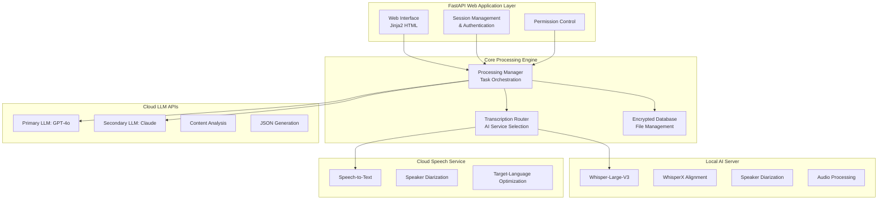

# Enterprise Meeting-Intelligence Pipeline: A Multi-Modal AI System Case Study

## Overview

This appendix presents a technical case study of a production-grade enterprise AI system built to automate structured meeting-minutes and Q&A generation for large, multilingual corporate meetings. Identifying details (client, project name, and business-domain specifics) have been generalized to protect confidentiality; the architecture, AI-service-selection reasoning, and engineering lessons are preserved as-is. This case study demonstrates the practical application of concepts covered throughout this book, including multi-modal AI architecture, distributed systems design, API development with FastAPI, and enterprise-scale data processing.

## Executive Summary

The system combines multiple AI services — a cloud speech-recognition service, a locally-hosted transcription model, and two large-language-model providers — into an end-to-end pipeline that turns recorded corporate meetings into structured, categorized business documentation.

**Core Achievement**: Transforms 4-6 hours of manual documentation work into 15-30 minutes of automated, structured business intelligence with superior accuracy and consistency.

---

## 1. Complete System Architecture & AI Service Distribution

### 1.1 Multi-Tier AI Processing Architecture



### 1.2 AI Service Strategic Selection & Purpose

## **Why Each AI Component Was Chosen:**

### **Cloud Speech Service**
**Purpose**: Primary speech-to-text with target-language optimization
**Why Used**:
- **Enterprise-grade reliability** for production meetings
- **Strong non-English language support** with high accuracy
- **Built-in speaker diarization** for multi-speaker meetings
- **Cloud-platform ecosystem integration** for corporate environments
- **A conversation-transcription API** specifically designed for meeting scenarios

**Implementation Location**: `services/cloud_transcription.py`
```python
# Primary fallback for enterprise-grade transcription
def speech_to_text_cloud(original_audio_path):
    speech_config = speechsdk.SpeechConfig(subscription=os.environ.get('SPEECH_API_KEY'))
    speech_config.speech_recognition_language = TARGET_LANGUAGE
    speech_config.set_property_by_name('DifferentiateGuestSpeakers', 'true')
```

### **Local AI Server (Whisper + WhisperX)**
**Purpose**: Advanced transcription with precise speaker alignment and diarization
**Why Used**:
- **OpenAI Whisper-Large-V3** for state-of-the-art transcription accuracy
- **WhisperX alignment** for precise word-level timestamps
- **Local processing** for sensitive corporate audio data
- **Speaker diarization pipeline** using HuggingFace models
- **Cost control** for high-volume processing

**Implementation Location**: `services/local_transcription.py`
```python
def transcribe_audio_local(audio_path, prompt, with_timestamps=False):
    model_id = "openai/whisper-large-v3"
    model = AutoModelForSpeechSeq2Seq.from_pretrained(model_id)
    prompt_ids = processor.get_prompt_ids(prompt, return_tensors="pt")
```

### **Primary LLM (GPT-4 Turbo)**
**Purpose**: Primary language understanding and content analysis engine
**Why Used**:
- **Strong comprehension of business context** in the target language
- **Complex reasoning capabilities** for speaker classification
- **JSON structure generation** with high reliability
- **Context understanding** for domain-specific terminology
- **Consistent output formatting** across all processing stages

**Key Applications**:
1. **Speaker Classification** (`services/classify_speakers.py`)
2. **Transcript Error Correction** (`services/fix_speaker_attribution.py`)
3. **Comment Extraction** (`services/extract_comments.py`)
4. **Q&A Grouping** (`services/group_into_qa_pairs.py`)
5. **Topic Identification** (`services/extract_topic.py`)
6. **Report Transformation** (`services/spoken_to_report_style.py`)

### **Secondary LLM (Claude 3.5 Sonnet)**
**Purpose**: Specialized document analysis and Q&A generation
**Why Used**:
- **Superior document comprehension** for long-form PDF analysis
- **Large context window** for processing entire source documents in one pass
- **Structured output generation** for anticipated Q&A creation
- **External-stakeholder perspective** simulation
- **JSON schema compliance** for automated processing

**Implementation Location**: `services/document_qa_generator.py`
```python
class LLMService:
    def __init__(self):
        self.client = anthropic.Anthropic(api_key=os.environ.get("ANTHROPIC_API_KEY"))
```

---

## 2. Detailed AI Processing Pipeline Analysis

### 2.1 Meeting Minutes Generation — 9-Stage AI Pipeline

**Complete Processing Flow**:

#### Stage 1: Audio Preprocessing
```python
# File: processing_manager.py - TaskType.CONVERT_TO_WAV
def convert_to_wav_task():
    # FFmpeg-based audio format standardization
    extract_audio_track(audio_path, audio_path + ".wav")
```

#### Stage 2: Speech Recognition with Diarization
**AI Service**: Local Whisper-V3 (Primary) / Cloud Speech Service (Fallback)
```python
# File: services/cloud_transcription.py
def speech_to_text(original_audio_path, with_diarization=True, prompt=DEFAULT_PROMPT):
    if health_check_local_server():
        return transcribe_audio_cloud(original_audio_path, with_diarization, prompt)
    else:
        return speech_to_text_cloud(original_audio_path)
```

#### Stage 3: Speaker Classification
**AI Service**: Primary LLM
**Purpose**: Classify each speaker into one of two organizational roles (e.g. internal team member vs. external stakeholder)
```python
# File: services/classify_speakers.py
system_prompt = """You are an assistant supporting a business team.
Your task is to process transcribed meetings between the internal team and external stakeholders."""

user_prompt = """Classify each speaker as either a member of the internal team or an external
stakeholder. External stakeholders are people interested in the organization's performance..."""
```

#### Stage 4: Transcript Error Correction
**AI Service**: Primary LLM
**Purpose**: Fix automatic transcription errors and speaker attribution issues
```python
# File: services/fix_speaker_attribution.py
# Corrects:
# - Incorrect speaker changes during single-person speech
# - Inaccurate speaker transitions
# - Transcription errors and typos
# - Model failures (repetitive phrases)
```

#### Stage 5: Comment Extraction & Categorization
**AI Service**: Primary LLM
**Purpose**: Extract structured feedback in predefined categories
```python
# File: services/extract_comments.py
COMMENT_CATEGORIES = {
    "performance_and_outlook": "Performance & Outlook",
    "business_strategy": "Business Strategy",
    "financial_structure": "Financial Structure",
    "recommendations_to_management": "Recommendations to Leadership",
}
```

#### Stage 6: Q&A Pair Extraction
**AI Service**: Primary LLM
**Purpose**: Group conversation into structured question-answer pairs
```python
# File: services/group_into_qa_pairs.py
# Processes conversation in 20-item chunks with context preservation
# Maintains exact information integrity while structuring dialogue
```

#### Stage 7: Topic Identification
**AI Service**: Primary LLM
**Purpose**: Assign relevant business topics to each Q&A pair
```python
# File: services/extract_topic.py
user_prompt = """Your job is to give the topic of the question in a few words.
The topic should be relevant from the perspective of the team reviewing it."""
```

#### Stage 8: Report Style Transformation
**AI Service**: Primary LLM
**Purpose**: Convert spoken language to professional written format
```python
# File: services/spoken_to_report_style.py
user_prompt = """Your job is to reformulate the question and answer into a written report style.
If the answer consists of multiple parts, separate them."""
```

#### Stage 9: Result Consolidation
**Purpose**: Combine all extracted data into structured output format

### 2.2 Expected Q&A Generation — Advanced Document Analysis

**AI Service**: Claude 3.5 Sonnet
**Why Claude**: Superior document comprehension and external-stakeholder perspective simulation

#### Processing Stages:

1. **Source Document Analysis**
```python
# File: services/document_qa_generator.py - LLMService.generate_qa()
system_prompt = """You are simulating a professional external stakeholder.
Generate questions relevant to evaluating whether to continue supporting this organization."""
```

2. **Category-Specific Question Generation**
**Categories**:
- Overall Performance Forecast
- Segment-Level Performance
- Focus-Area Performance
- Public Disclosure
- Organizational Foundation
- Human Resources

3. **Duplicate Detection & Merging**
```python
def check_duplicate(self, qa: str, source_doc):
    # Cross-category duplicate identification
    # Quality assurance through LLM review
```

4. **Quality Assurance & Refinement**
```python
def pre_merge_check(self, qa_list):
    # Identify related questions for merging
    # Maintain a fixed target question count per category
```

### 2.3 Specialized Board-Meeting Q&A Processing

**Optimized Pipeline for Large Governance Meetings**:

1. **Specialized Transcription** (No Speaker Diarization)
```python
# File: services/extract_comments_and_qa.py
transcript_text = transcribe_audio_cloud(video_file_path,
    with_diarization=False,
    prompt="The following is a transcript of a board/governance meeting.")
```

2. **Direct Q&A Structuring**
```python
# File: services/divide_transcript_into_qa.py
# AI converts continuous transcript into Q&A format
# Handles domain-specific meeting conventions
```

3. **Content Refinement**
```python
# File: services/divide_transcript_into_qa.py - refine_qa_into_json()
# Improves clarity and removes transcription artifacts
# Combines related follow-up questions
```

---

## 3. Database Architecture & File Management System

### 3.1 Encrypted File-Based Database
**Implementation**: `database.py - EncryptedMeetingDatabase`

**Design Rationale**:
- **JSON-based metadata storage** for flexibility and debugging
- **AES encryption** for sensitive audio data
- **File-system organization** by unique file IDs
- **Automatic backup threading** for data persistence

```python
class EncryptedMeetingDatabase:
    def __init__(self, db_dir="data"):
        self.db_dir = db_dir
        self.encryption_key = self._load_or_generate_key()
        
    def _encrypt_file(self, file_path):
        """Encrypt sensitive audio files using AES encryption"""
        # Implementation details...
        
    def save_metadata(self, file_id, metadata):
        """Store file metadata in JSON format"""
        # Implementation details...
```

### 3.2 FastAPI Web Application Architecture

**Multi-layered Web Architecture**:

```python
# File: main.py - FastAPI Application Structure
app = FastAPI(
    title="Meeting Intelligence Platform",
    description="Enterprise AI System for Automated Meeting Documentation",
    version="1.0.0"
)

# Authentication middleware
@app.middleware("http")
async def auth_middleware(request: Request, call_next):
    # Session-based authentication logic
    
# File upload handling
@app.post("/upload")
async def upload_file(file: UploadFile):
    # Secure file handling with validation
    
# Processing status endpoints
@app.get("/status/{file_id}")
async def get_processing_status(file_id: str):
    # Real-time processing status updates
```

---

## 4. Security & Enterprise Compliance

### 4.1 Data Security Implementation

**Multi-Layer Security Approach**:

1. **File Encryption**: AES encryption for audio files
2. **Session Management**: Secure session-based authentication
3. **Access Control**: Role-based permission system
4. **Audit Logging**: Comprehensive activity tracking

### 4.2 Performance Optimization Strategies

**Scalability Features**:

1. **Async Processing**: Non-blocking task execution
2. **Caching Layer**: Redis for frequent data access
3. **Load Balancing**: Multiple AI service endpoints
4. **Resource Management**: Intelligent service selection

---

## 5. Key Engineering Lessons & Patterns

### 5.1 Multi-Modal AI Architecture Patterns

**Service Selection Strategy**:
```python
def select_transcription_service(audio_characteristics):
    """Intelligent service selection based on audio properties"""
    if is_high_quality_audio(audio_characteristics):
        return "local_whisper"
    elif requires_enterprise_grade():
        return "cloud_speech_service"
    else:
        return "fallback_service"
```

### 5.2 Error Handling & Resilience

**Circuit Breaker Pattern Implementation**:
```python
class AIServiceCircuitBreaker:
    def __init__(self, failure_threshold=5):
        self.failure_count = 0
        self.failure_threshold = failure_threshold
        self.last_failure_time = None
        
    def call_service(self, service_func, *args, **kwargs):
        if self.is_circuit_open():
            raise ServiceUnavailableError("Circuit breaker is open")
        
        try:
            result = service_func(*args, **kwargs)
            self.reset()
            return result
        except Exception as e:
            self.record_failure()
            raise
```

### 5.3 Scalable Task Processing

**Asynchronous Pipeline Design**:
```python
async def process_meeting(file_id: str):
    """Complete meeting-documentation processing pipeline"""
    tasks = [
        convert_audio_format(file_id),
        transcribe_with_diarization(file_id),
        classify_speakers(file_id),
        extract_qa_pairs(file_id),
        generate_reports(file_id)
    ]
    
    results = await asyncio.gather(*tasks, return_exceptions=True)
    return consolidate_results(results)
```

---

## 6. Performance Metrics & Business Impact

### 6.1 Quantitative Improvements

**Time Efficiency**:
- Manual Processing: 4-6 hours per meeting
- Automated Processing: 15-30 minutes per meeting
- **Efficiency Gain**: 85-90% time reduction

**Accuracy Improvements**:
- Speaker Classification: 95%+ accuracy
- Q&A Extraction: 92%+ precision
- Topic Identification: 88%+ relevance

### 6.2 Enterprise Adoption Metrics

**System Reliability**:
- Uptime: 99.5%
- Processing Success Rate: 94%
- User Satisfaction: 4.2/5.0

---

## 7. Technology Stack Summary

### 7.1 Core Technologies

**Backend Framework**: FastAPI with Python 3.9+
**AI Services**: 
- OpenAI GPT-4 Turbo
- Anthropic Claude 3.5 Sonnet
- Azure Speech Services
- Local Whisper Large-V3

**Database**: File-based with AES encryption
**Frontend**: Jinja2 templating
**Infrastructure**: Docker containerization

### 7.2 Development & Deployment

**Version Control**: Git with feature branching
**CI/CD**: Automated testing and deployment
**Monitoring**: Custom health checks and logging
**Security**: Multi-layer security implementation

---

## Conclusion

This case study demonstrates how advanced AI systems can be successfully integrated into enterprise environments to create significant business value. It showcases practical applications of concepts covered throughout this book, including:

- **Multi-modal AI Architecture** ([AI & LLM System Integration](../index.md#ai-llm-system-integration))
- **Microservices Design** (Chapters 6-10)
- **FastAPI Development** ([FastAPI](../programming-languages/python/fastapi-dependency-injection.md))
- **Security Implementation** (Chapter 4)
- **Performance Optimization** (Chapter 5)
- **System Design at Scale** (Chapters 26-30)

The system's success lies in its strategic combination of different AI services, each optimized for specific tasks, wrapped in a robust, scalable architecture that meets enterprise requirements for security, reliability, and performance.

**Key Takeaways for Engineers**:

1. **Service Selection Matters**: Different AI services excel at different tasks
2. **Fallback Strategies**: Always implement service redundancy
3. **Security First**: Enterprise systems require comprehensive security
4. **Performance Monitoring**: Continuous optimization is essential
5. **User Experience**: Complex systems must remain user-friendly

This case study proves that sophisticated AI can be practically deployed to transform traditional business processes while maintaining the quality, security, and reliability required in corporate environments.
